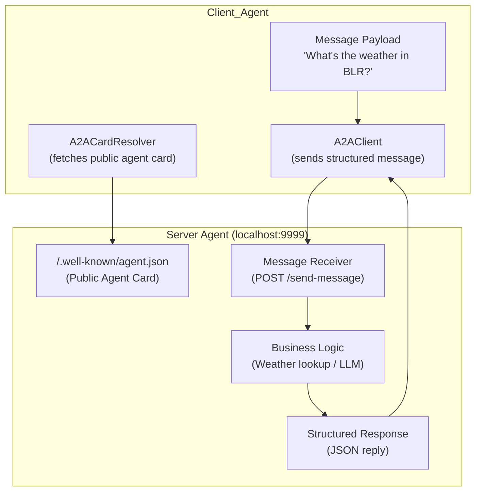

# A basic A2A agent 

Sample using Agent-to-Agent (A2A) communication protocol

## Check Agent Details

- Run the server using below command.

  ```shell
  python main.py
  ```

- Then navigate to the URL `http://localhost:9999/.well-known/agent.json`
- You should be able to see Agent Details

  ```json
  {
    "capabilities": {

    },
    "defaultInputModes": [
      "text"
    ],
    "defaultOutputModes": [
      "text"
    ],
    "description": "A simple agent that returns weather information",
    "name": "Weather agent",
    "skills": [
      {
        "description": "Share weather specific information",
        "examples": [
          "What is the weather of blr?"
        ],
        "id": "weather_agent",
        "name": "Weather Agent",
        "tags": [
          "weather info"
        ]
      }
    ],
    "url": "http://localhost:9999",
    "version": "1.0.0"
  }
  ```

## Run the Client

- Once the server is up and running.
- Run the below command to get the response from the server.

  ```shell
  python client.py
  ```

- If everything goes fine, you should a response. 

  ```json
  {
    "id": "ccaa00f9-8e23-42bb-9880-995865b13e16",
    "jsonrpc": "2.0",
    "result": {
      "kind": "message",
      "messageId": "c0566785-ddf7-40a2-a6fe-03c0601e44e6",
      "parts": [
        {
          "kind": "text",
          "text": "{\"city\": \"BLR\", \"temp\": \"10c\"}"
        }
      ],
      "role": "agent"
    }
  }

  ```

## Visual Explaination

