# Basic Agent flow

## Prerequisite

Before running this project, make sure the following are in place:

To run this agent, you'll need a GitHub token (used here as a secret key to access an OpenAI-compatible endpoint):

### 👉 Follow these steps:

1. Go to **GitHub** Token Settings https://github.com/settings/tokens
2. Click `Generate new token (classic)`
3. Give it a name
4. Select scopes based on what's needed:
5. For this sample (as an API key), you typically don’t need any scopes unless the endpoint requires GitHub access.
6. Generate the token and copy it — you won’t see it again.

## How to run this project

1. Make sure you have python `3.12` installed in your local learning environment. 
2. You'll need a `.env` file in the root directory with the following:

    ```shell
    GITHUB_TOKEN=your-access-token-here
    ```
    > [!NOTE] 
    > This token is used as an API key to authenticate with the custom OpenAI-compatible endpoint.


## Visual Explaination

```mermaid
flowchart TD
    A["🧑 User Query\ne.g., 'What is 10 - 3?'"] --> B["AgentExecutor\n(LangChain)"]
    B --> C["create_openai_tools_agent()\n(LLM + tools + prompt)"]
    C --> D1["🧠 LLM\nGPT-4.1 API (custom endpoint)"]
    C --> D2["🧰 Tools\nadd(a, b), subtract(a, b)"]
    D1 & D2 --> E["📝 Final Answer\ne.g., '7'"]

```

