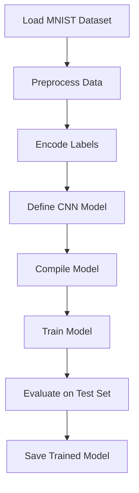
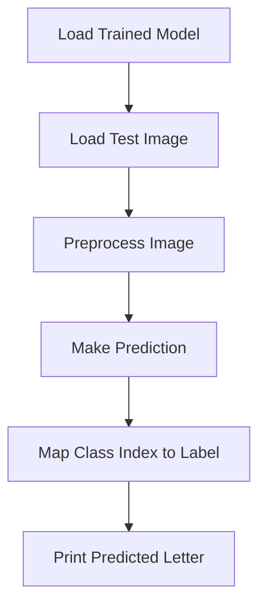

## Basic CNN model

### Prerequisite

- For downloading the MNIST dataset under tensorflow.keras

```sh
open /Applications/Python\ 3.x/Install\ Certificates.command
```

### Model Training

- Train the model using below command:

```sh
python model.py
```

- Model gets saved as `keras` format.

### Evaluate Model

- Test the model using below command:

```sh
python evaluate.py
```

### Visual Explaination

#### Training



#### Testing

