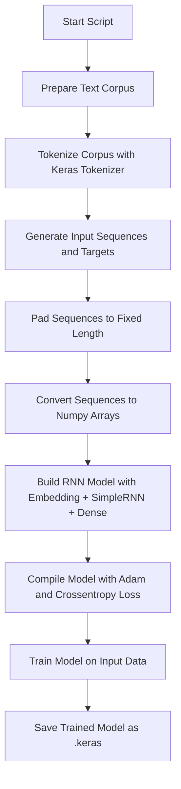
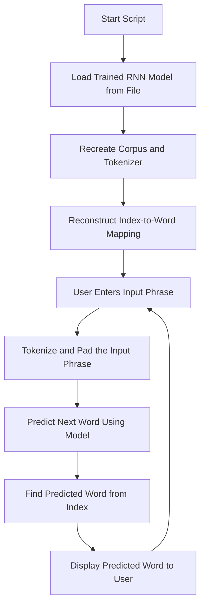

## Basic RNN model

Basic RNN for the next Word Prediction

### Model Training

- Train the model using below command:

```sh
python model.py
```

- Model gets saved as `keras` format.

### Evaluate Model

- Test the model using below command:

```sh
python evaluate.py
```

### Visual Explaination

#### Training



#### Testing

