## Tracing agent call with LangSmith

### Enable LangSmith

- SignUp https://www.langchain.com/langsmith
- Create an API key and save it.
- Export following configuration with details.
- You could also set this as environment variable.

```shell
export LANGCHAIN_PROJECT="basic-agent-tracing-langsmith"
export LANGCHAIN_TRACING_V2=true
export LANGSMITH_API_KEY="<your-langsmith-api-key>"
```

### Trace Output

- Don't need any special call to any of the tracing API.
- Every time you run a chain or agent, LangSmith will now automatically capture the trace.


## Visual Explaination

```mermaid
flowchart TD

%% Config & Setup
A[🔧 Load .env Variables] --> B[🔐 Get GitHub Token & Endpoint]
B --> C[🧠 Initialize ChatOpenAI<br/>GPT-4.1 via GitHub Inference]

%% Tool Definitions
subgraph Tools
    D1[➕ Define Tool: add a, b]
    D2[➖ Define Tool: subtract a, b]
end

%% Prompt Setup
C --> E[📝 Create Prompt Template<br/>with Chat History & Scratchpad]
E --> F[🔗 Register Tools & Prompt<br/>with LLM Agent]

%% Agent & Execution
F --> G[🤖 Create OpenAI Tools Agent]
G --> H[🚀 agent_executor.invoke<br/>with user input]

%% Execution Flow
H --> I[🧠 Agent Selects Tool<br/>based on prompt + input]
I --> J[🛠️ Execute Tool<br/>e.g., subtract 10, 3]
J --> K[💬 Format Final Answer<br/>from Tool Result]

%% Output and Tracing
K --> L[📤 Return Answer to User]
L --> M[📈 Trace sent to LangSmith<br/>if env configured]

%% Style Definitions
classDef llm fill:#E1F5FE,stroke:#0288D1,stroke-width:2px;
```



