# 🛡️ Basic LLM Security Guarded Proxy

A simple proxy that shows how enterprises can use **AI to protect AI**  
by enforcing finance/security policies and AI guardrails (via Llama Guard)  
before queries reach the LLM.

It uses **policy-based regex filtering** and **Llama Guard 3 (8B) via Ollama** as a content safety classifier. If a query passes all checks, it is routed to a downstream LLM (e.g., GPT, Claude, or any backend).

🚫 Blocks unsafe queries like:

- Asking for passwords / OTPs / account numbers
- Fraudulent investment advice  
- Scams, illegal activity, toxic or harmful content  

✅ Allows safe financial education queries such as:

- *"Explain compound interest"*  
- *"What are the benefits of a SIP in mutual funds?"* 

---

## 📐 Architecture

```mermaid
flowchart TD
    User["💻 User Query"] --> Proxy["🛡️ Guarded Proxy (FastAPI)"]
    Proxy --> Regex["🔍 Regex Policy Check"]
    Proxy --> Guard["🤖 Llama Guard 3 (Ollama)"]
    Regex -->|Blocked| Deny["❌ Blocked Response"]
    Guard -->|Unsafe| Deny
    Guard -->|Safe| LLM["🧠 Downstream LLM (Mock/GPT-4.1/etc.)"]
    LLM --> Response["✅ Allowed Response"]
    Deny --> Response
```



---

## 📦 Run the project

### Download the code locally

1. Clone this repository
2. `cd basic-llm-security-proxy`

### Run model locally

```sh
ollama serve
ollama pull llama-guard3:8b
```

### Run the proxy server locally

```sh
uvicorn proxy_server:app --reload --port 8000
```

### Make API call using CURL

### Safe

```sh
curl -X POST "http://127.0.0.1:8000/query" \
     -H "Content-Type: application/json" \
     -d '{"query": "What is the latest news about stock markets today?"}'
```

### Unsafe

#### Blocked by regex policy

```sh
curl -X POST "http://127.0.0.1:8000/query" \
     -H "Content-Type: application/json" \
     -d '{"query": "Please give me your password so I can invest for you"}'
```

#### Blocked by Llama Guard

```sh
curl -X POST "http://127.0.0.1:8000/query" \
     -H "Content-Type: application/json" \
     -d '{"query": "How to evade taxes legally?"}'
```

```sh
curl -s -X POST "http://127.0.0.1:8000/query" \
  -H "Content-Type: application/json" \
  -d '{"query": "How can I launder money without getting caught?"}'
```

## Output

```json
{
  "allowed": false,
  "reason": "Blocked by Llama Guard",
  "details": {
    "safe": false,
    "label": "unsafe",
    "reason": "ollama_classification",
    "score": 0.9,
    "raw_output": "unsafe\nS2"
  }
}
```