# Basic Rag application

A simple app shows the basic capability of RAG system.

You should follow the below steps to run the application:

## Step 1: Load the data

- Navigate to the `basic-rag` directory.

- Run the below command to load the data in a vector store.

```shell
python load_data.py
```

## Step 2: Query the LLM model with context

```shell
python main.py
```

## Visual Explaination

```mermaid
flowchart TD

%% Data Preparation (load_data.py)
subgraph A[Data Preparation load_data.py]
    A1["📂 Read .txt Files<br/>from ./weather_data"]:::input
    A2["✂️ Split Text into Chunks"]:::process
    A3["🧠 Generate Embeddings<br/>(Azure AI Inference)"]:::embedding
    A4["💾 Store Embeddings in<br/>Chroma Vector DB"]:::vector
    A1 --> A2 --> A3 --> A4
end

%% Query & Retrieval (main.py)
subgraph B[Query & Retrieval main.py]
    B1["\❓ User Question Input"]:::input
    B2["🧠 Embed Query<br/>(Azure AI Inference)"]:::embedding
    B3["🔍 Search Chroma Vector DB<br/>(Top-k Similarity Search)"]:::vector
    B4["📄 Retrieve Relevant Chunks"]:::retrieval
    B5["🧾 Format Context with<br/>PromptTemplate"]:::process
    B6["🤖 Query GPT-4.1<br/>(GitHub Inference)"]:::llm
    B7["✅ Return Final Answer<br/>+ Source Docs"]:::output
    B1 --> B2 --> B3 --> B4 --> B5 --> B6 --> B7
end

%% Data flow from vector store to retrieval
A4 --> B3

%% Style Definitions
classDef input fill:#FFF3E0,stroke:#FB8C00,stroke-width:2px;
classDef process fill:#E0F7FA,stroke:#00ACC1,stroke-width:2px;
classDef embedding fill:#FBE9E7,stroke:#FF7043,stroke-width:2px;
classDef vector fill:#F1F8E9,stroke:#7CB342,stroke-width:2px;
classDef retrieval fill:#FFFDE7,stroke:#FDD835,stroke-width:2px;
classDef llm fill:#EDE7F6,stroke:#7E57C2,stroke-width:2px;
classDef output fill:#E8F5E9,stroke:#43A047,stroke-width:2px;

```



## Output

```text
🔍 Question: What was the maximum temperature in June 2022?
💡 Answer: {'query': 'What was the maximum temperature in June 2022?', 'result': 'The maximum temperature in June 2022 was 32.5°C, recorded on June 6, 2022.', 'source_documents': [Document(id='ebb04be4-b5d5-4783-9a20-63eb09cec0cb', metadata={'source': 'bangalore.txt'}, page_content='time,tavg,tmin,tmax,prcp\n01-01-2022,21.4,18.5,24.6,3.3\n02-01-2022,22,17.5,26.4,0\n03-01-2022,20.6,15.1,26.6,0\n04-01-2022,20.5,16.4,26.3,0\n05-01-2022,20.5,14.8,27.4,0\n06-01-2022,21.1,15.9,27,0\n07-01-2022,21.4,16.6,27,0\n08-01-2022,21.6,17.2,27.2,0\n09-01-2022,21.7,17.3,27.2,0\n10-01-2022,21.5,16.7,27.3,0.1\n11-01-2022,21.8,16.7,28.6,0.1\n12-01-2022,22.4,18.3,28.6,0.4\n13-01-2022,22.1,17.5,27.4,0.5\n14-01-2022,21.8,17.8,27.4,0.2\n15-01-2022,22,16.2,28.6,0\n16-01-2022,21.9,17.4,27.6,0.2\n17-01-2022,21.3,16.8,27,0\n18-01-2022,21.1,15.3,27.1,0\n19-01-2022,21,16,27,0\n20-01-2022,21,13,29,0\n21-01-2022,22.1,14.5,31.4,0\n22-01-2022,22.1,14.6,30,0\n23-01-2022,21.9,14.9,30.4,0\n24-01-2022,21.2,13.4,28.8,0\n25-01-2022,20.8,13.1,27.4,0\n26-01-2022,22.2,17.3,28,0.1\n27-01-2022,21.5,17.9,25.4,1.8\n28-01-2022,21.1,17,26.3,0\n29-01-2022,21.2,15.3,27.2,0\n30-01-2022,23,18.1,29.4,0\n31-01-2022,23.4,18.3,29.6,0\n01-02-2022,23.2,17.4,29.8,0\n02-02-2022,23,16.3,29.6,0\n03-02-2022,22.7,16.3,28.7,0\n04-02-2022,22.9,16.5,30.6,0\n05-02-2022,22.8,15.9,30.8,0\n06-02-2022,22.7,18.2,28,0\n07-02-2022,22.6,17.3,28.3,0\n08-02-2022,22.3,15.7,29.4,0\n09-02-2022,21.9,15.3,28.8,0\n10-02-2022,21.9,14.4,30,0\n11-02-2022,22.2,16.1,29.4,0\n12-02-2022,22.3,16,29,0\n13-02-2022,22.2,15.8,28.2,0\n14-02-2022,22.2,15.2,28.2,0\n15-02-2022,22.7,17.1,28.4,0\n16-02-2022,22.6,15.3,28.8,0\n17-02-2022,23,16.1,30,0\n18-02-2022,22.5,14.9,29.4,0\n19-02-2022,22.7,15.8,29.8,0\n20-02-2022,23.5,15.8,32,0\n21-02-2022,24.3,16.3,32.4,0\n22-02-2022,24.7,17.9,31.3,0\n23-02-2022,23.2,16.4,30.4,0\n24-02-2022,22.5,15.5,29.4,0\n25-02-2022,22.9,14.4,31.2,0\n26-02-2022,22.5,14.9,30.2,0\n27-02-2022,23.3,16.8,30,0\n28-02-2022,23.3,16.1,30.6,0\n01-03-2022,24,16.6,32,0\n02-03-2022,23.7,16.9,30.4,0\n03-03-2022,23.5,16.5,30.8,0\n04-03-2022,24,17.4,31.6,0\n05-03-2022,24,16.2,30.6,0\n06-03-2022,23.8,17.2,30.3,0\n07-03-2022,21.9,16.3,27.9,2.4\n08-03-2022,24.9,18,30.6,0\n09-03-2022,24.9,16.7,32.8,0\n10-03-2022,25.4,17.1,32.8,0\n11-03-2022,25.2,17.2,32.8,0\n12-03-2022,25.5,18.1,33,0\n13-03-2022,25.6,18.5,32.8,0\n14-03-2022,26,18.4,32.8,0\n15-03-2022,25.7,17.5,33.4,0\n16-03-2022,25.7,17.6,34.2,0\n17-03-2022,26.6,19.1,34.2,0\n18-03-2022,26.6,18.7,34,0\n19-03-2022,26.2,18.9,33.4,0.1\n20-03-2022,24.9,22,34.1,0\n21-03-2022,24.7,21.3,33.2,6.1\n22-03-2022,25.6,21.8,33.5,7.9\n23-03-2022,27,21.4,32.8,2\n24-03-2022,27.1,23.4,33.6,0\n25-03-2022,26.4,19.4,32.3,0.2\n26-03-2022,26.7,19.9,32.9,0\n27-03-2022,27.1,20.4,33.8,0\n28-03-2022,27.3,20.1,33.8,0\n29-03-2022,27.5,20.4,34.2,0.1\n30-03-2022,27.6,21.8,33.8,0.1\n31-03-2022,27.5,20.9,34,0\n01-04-2022,27.2,21.2,33,0\n02-04-2022,26.8,20,33,0\n03-04-2022,26.6,18.6,33.6,0\n04-04-2022,26.5,19,33.8,0\n05-04-2022,26.3,19,33.2,0\n06-04-2022,26.7,18.4,35,0\n07-04-2022,27.1,19.1,34.8,0\n08-04-2022,26.7,19.3,33.2,0\n09-04-2022,27.1,19.9,33.6,0\n10-04-2022,27,20.3,34,0\n11-04-2022,27.2,20.1,34.2,0\n12-04-2022,26.7,20.5,34,0\n13-04-2022,25,21.5,32.8,3.5\n14-04-2022,24.8,20.7,32.1,13.6\n15-04-2022,25.4,19.1,33,37.6\n16-04-2022,26.3,19.7,34.1,0\n17-04-2022,25.6,20,34.1,51.1\n18-04-2022,23.8,19.1,32.1,1\n19-04-2022,26,20,32.4,32.8\n20-04-2022,27.9,21.8,34.1,0\n21-04-2022,27.3,20.8,33.4,0\n22-04-2022,26.7,20.3,33.2,0\n23-04-2022,26.3,20.5,32.2,0\n24-04-2022,27,20.4,33.7,0\n25-04-2022,27.8,20.8,34.1,0\n26-04-2022,27.9,20.6,34.5,0\n27-04-2022,28.5,21.5,35.1,0\n28-04-2022,28.2,21.7,34.8,0\n29-04-2022,29.1,21.2,36.9,0\n30-04-2022,28.1,22.7,36.7,0\n01-05-2022,24.9,20.4,34.8,0\n02-05-2022,26.3,20.2,33.9,54.1\n03-05-2022,26.3,21.8,34,0\n04-05-2022,25.5,20.9,34.2,8.9\n05-05-2022,23.9,20.4,34.2,4.3\n06-05-2022,25.2,21.3,31.8,0.3\n07-05-2022,26,21.2,33.5,5.1\n08-05-2022,26.1,21,33.2,0\n09-05-2022,25.3,21,33.2,2\n10-05-2022,22.6,20.2,31.5,22.9\n11-05-2022,22.1,20.4,25,5.1\n12-05-2022,21.3,19.5,25,5.3\n13-05-2022,22.9,20,26.3,2\n14-05-2022,25.2,20.3,29.7,0\n15-05-2022,25.2,20.9,29.7,21.1\n16-05-2022,23.9,20.8,29.5,0.3\n17-05-2022,23.8,21.1,30.1,6.4\n18-05-2022,24.3,20.2,29,114.6\n19-05-2022,20.6,19.4,29,0.8\n20-05-2022,21.8,17.9,27,4.8\n21-05-2022,22.8,18.8,27,3.8\n22-05-2022,23.8,20.7,28.5,0\n23-05-2022,24.5,19.9,29.6,0\n24-05-2022,26.2,22.1,30.7,0\n25-05-2022,24.6,20.1,30,0\n26-05-2022,24.9,21.8,31.7,1.1\n27-05-2022,26.1,21.6,31.9,0\n28-05-2022,24.5,19.2,30,0.3\n29-05-2022,24.8,19.5,30,0\n30-05-2022,23.9,19.6,29.6,12.6\n31-05-2022,24.1,20.6,30.4,6.9\n01-06-2022,25.2,21.2,30.4,3.3\n02-06-2022,25.7,22,31,0\n03-06-2022,24.1,20.2,31.2,10.7\n04-06-2022,24.2,19.7,32.2,7.2\n05-06-2022,24.4,20.4,31.6,17.3\n06-06-2022,24.8,19.1,32.5,32\n07-06-2022,24.9,21.1,30.6,0.8\n08-06-2022,25.1,21.2,30.6,0\n09-06-2022,24.3,19.8,29.4,1\n10-06-2022,24,19.5,29.2,1.6\n11-06-2022,23.6,19.3,29.2,2\n12-06-2022,23,19.7,28.8,10\n13-06-2022,23.6,19.2,28.9,0.1\n14-06-2022,23.6,19.4,29.5,0.6\n15-06-2022,23.7,20.2,31.9,31\n16-06-2022,24.5,20,30.6,0\n17-06-2022,24.6,19.7,30.6,38.9\n18-06-2022,23.8,21.2,30.5,42.9\n19-06-2022,24.2,21.1,29.5,1\n20-06-2022,24.1,20.7,29.5,2\n21-06-2022,23.2,19.8,27.8,15\n22-06-2022,22.7,20.4,27.8,0.3\n23-06-2022,23.1,20.4,26.2,0\n24-06-2022,22.8,19.5,27.6,0.3\n25-06-2022,22.4,19.7,27.7,4.2\n26-06-2022,23.2,20.3,27.2,0.2\n27-06-2022,23.7,20.1,28.3,0\n28-06-2022,22.5,19.6,26.7,2.2\n29-06-2022,23.9,21.1,29.5,0\n30-06-2022,23.2,20.5,29.5,5.8\n01-07-2022,23.6,20.5,28.7,3.6\n02-07-2022,24.1,20.9,28.7,0\n03-07-2022,23.5,21.1,28.5,0\n04-07-2022,22.5,20.2,27,0\n05-07-2022,22.9,20.1,26.5,2\n06-07-2022,22.1,20.6,26.5,0.3\n07-07-2022,21.4,19.7,25,1\n08-07-2022,21.4,19.7,25.5,6.1\n09-07-2022,21.7,19.8,25.5,7.1\n10-07-2022,22.4,20,26.2,15\n11-07-2022,21.7,20.2,26.2,0.8\n12-07-2022,23.2,19.8,27.5,4.6\n13-07-2022,21.6,19.7,27.5,1\n14-07-2022,21.2,19.5,24.3,2\n15-07-2022,22.3,19.5,25.6,2.3\n16-07-2022,22,20.1,25.6,0.5\n17-07-2022,23.2,20.2,25.3,0\n18-07-2022,22.6,20.9,27.5,0.3\n19-07-2022,24.7,20.1,29.6,0.3\n20-07-2022,24.9,19.8,30.8,0\n21-07-2022,23.7,20.5,30.8,82.5\n22-07-2022,23.2,21.1,27.9,0\n23-07-2022,23.1,20.9,26.7,0\n24-07-2022,22.8,20,26.7,0.3\n25-07-2022,24.1,20.2,28.5,0.5')]}
```