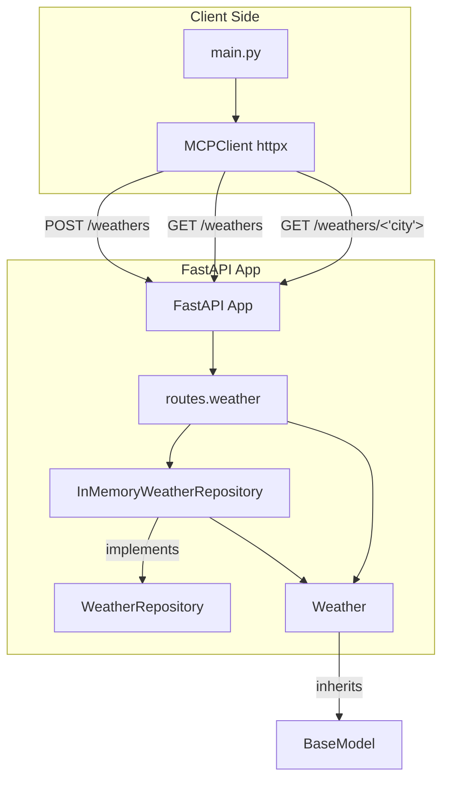

## Fast API server and client

### Run the server

- Navigate to the `fastapi-mcp-api` directory.
- And execute the below command to run the server.

    ```sh
    uvicorn main:app --reload
    ```

### Run the client

- Navigate to the `test-mcp-client` directory.
- Then run the below command to execute the client.

    ```sh
    python main.py
    ```

## Visual Explaination

