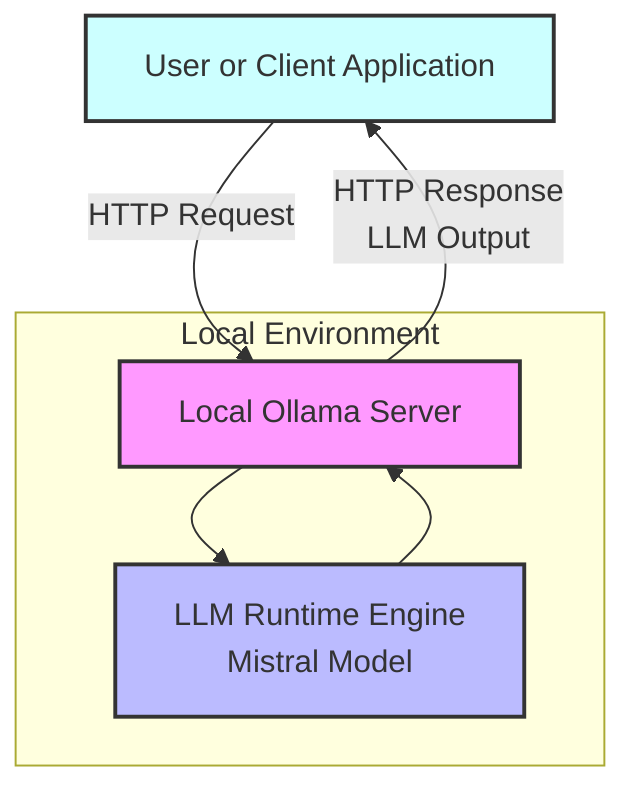

## Clean up script

```sh
docker rm -f $(docker ps -aq)
```

## Visual Explaination


```mermaid
flowchart TD
    A[User or Client Application] -->|HTTP Request| B[Local Ollama Server]
    B --> C[LLM Runtime Engine\nMistral Model]
    C --> B
    B -->|HTTP Response\nLLM Output| A

    subgraph Local Environment
        B
        C
    end

    style B fill:#f9f,stroke:#333,stroke-width:2px
    style C fill:#bbf,stroke:#333,stroke-width:2px
    style A fill:#cff,stroke:#333,stroke-width:2px

```