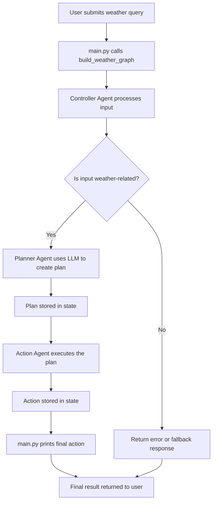
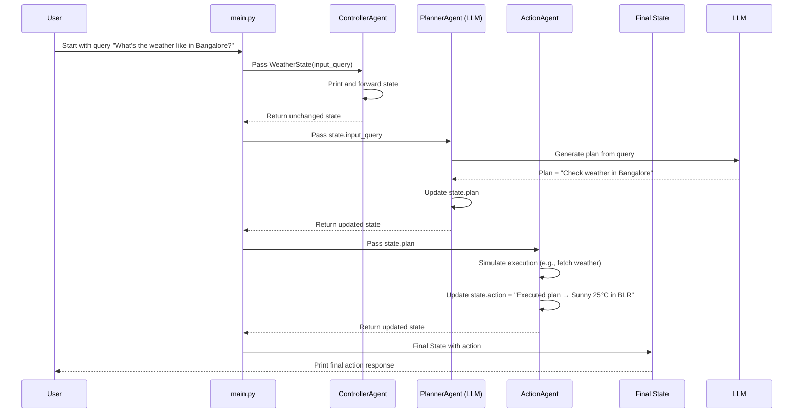

## Basic Multi Agent System

This project demonstrates a simple yet powerful multi-agent architecture using LangGraph. It simulates collaborative decision-making across three specialized agents:

Controller Agent: Validates and interprets the user's input query.

Planner Agent: Uses an LLM to generate a structured plan based on the user’s intent.

Action Agent: Executes the plan and returns a response, such as the current weather information.

Each agent operates independently with a shared memory structure (WeatherState), enabling them to communicate, coordinate, and solve tasks step-by-step. This pattern allows for modular, scalable, and LLM-driven orchestration, ideal for real-world applications like customer support, travel planning, or weather advisory systems.


## Execute the system

```sh
python main.py
```

### Visual Explaination

#### Flow Diagram



#### Sequence Diagram 

