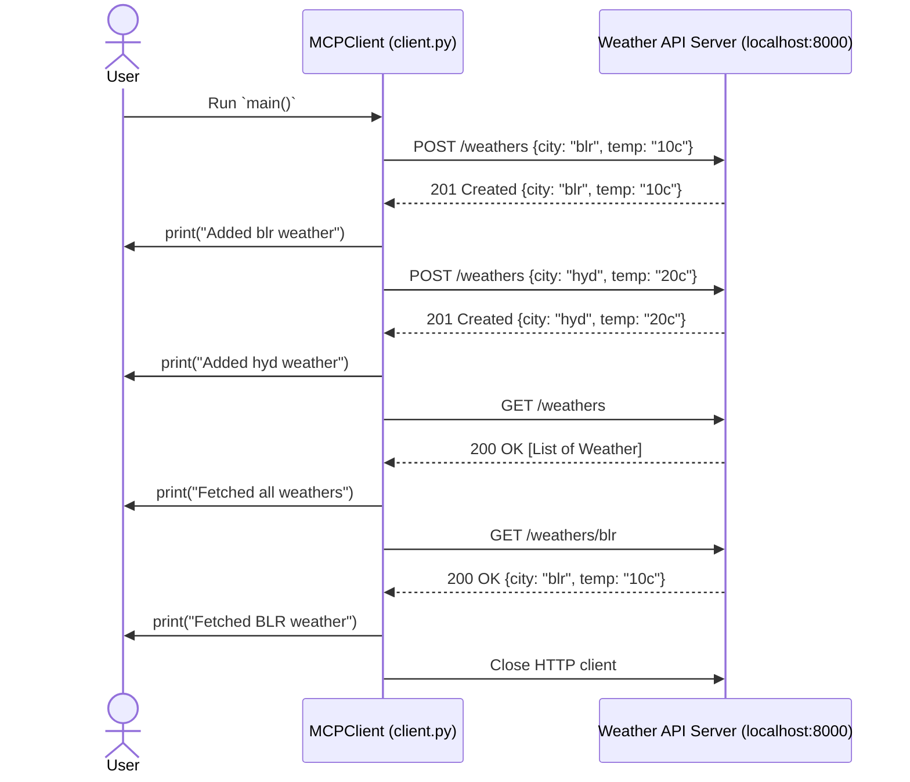

# Test MCP Client

A simple project that showcase how a MCP client and server would work interact with each other.

### Visual Explaination

```mermaid
sequenceDiagram
    actor User
    participant MCPClient as MCPClient (client.py)
    participant Server as Weather API Server (localhost:8000)

    User->>MCPClient: Run `main()`
    
    MCPClient->>Server: POST /weathers {city: "blr", temp: "10c"}
    Server-->>MCPClient: 201 Created {city: "blr", temp: "10c"}
    MCPClient->>User: print("Added blr weather")

    MCPClient->>Server: POST /weathers {city: "hyd", temp: "20c"}
    Server-->>MCPClient: 201 Created {city: "hyd", temp: "20c"}
    MCPClient->>User: print("Added hyd weather")

    MCPClient->>Server: GET /weathers
    Server-->>MCPClient: 200 OK [List of Weather]
    MCPClient->>User: print("Fetched all weathers")

    MCPClient->>Server: GET /weathers/blr
    Server-->>MCPClient: 200 OK {city: "blr", temp: "10c"}
    MCPClient->>User: print("Fetched BLR weather")

    MCPClient->>Server: Close HTTP client
```