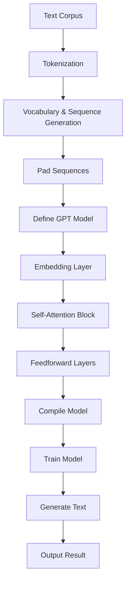

```mermaid
flowchart TD
    A[Text Corpus] --> B[Tokenization]
    B --> C[Vocabulary & Sequence Generation]
    C --> D[Pad Sequences]

    D --> E[Define GPT Model]
    E --> F[Embedding Layer]
    F --> G[Self-Attention Block]
    G --> H[Feedforward Layers]

    H --> I[Compile Model]
    I --> J[Train Model]
    J --> K[Generate Text]
    K --> L[Output Result]
```