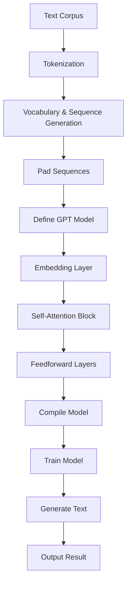

# A simple tiny GPT model

> 📌 **Note:** This model is for educational purposes only. It is trained on a small dataset and is not intended for production use.

- `Tensorflow 2.15.0` doesn't support `3.12` and needs `3.11`
- Setup the poetry shell with the following command:

    ```sh
    poetry env use /usr/local/bin/python3.11
    ```

- Use the newly created shell

    ```sh
    poetry shell
    ```

- Running the model with character embedding.

    ```sh
    python model_char_embedding.py
    ```

- Running the model with word embedding.

    ```sh
    python model_word_embedding.py
    ```

## Visual Explaination

