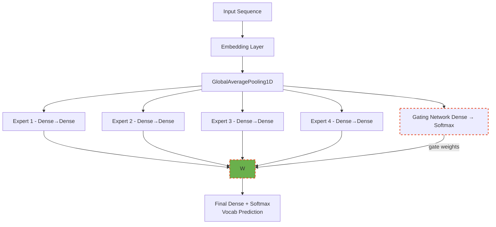
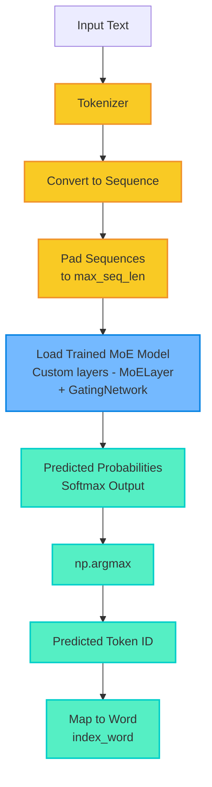

# Mixture of Experts (MoE)

**Mixture of Experts (MoE)** is a model architecture that leverages multiple specialized sub-models — called *experts* to process different aspects of the input. Rather than relying on a single, large model to handle all inputs, MoE uses a *gating* mechanism to dynamically route each input to the most relevant experts. This approach improves both efficiency and scalability.

## MoE Vs Transformer

| Feature                        | Mixture of Experts (MoE)                                                                                                 | Transformer                                                                                       |
| ------------------------------ | ------------------------------------------------------------------------------------------------------------------------ | ------------------------------------------------------------------------------------------------- |
| **Core Idea**                  | Uses multiple expert networks, and a gating mechanism selects a few to activate per input.                               | Relies on self-attention to model relationships between all tokens.                               |
| **Computation Efficiency**     | Sparse computation (only a few experts are active per input) → Efficient scaling.                                        | Dense computation — all parameters used per forward pass.                                         |
| **Scalability**                | Scales well to very large models with reduced computation cost.                                                          | Scaling increases both compute and memory proportionally.                                         |
| **Example Open Source Models** | - [Mixtral](https://mistral.ai/news/mixtral-of-experts)<br> - [GLaM](https://arxiv.org/abs/2112.06905) (Google)<br>- [Switch Transformer](https://arxiv.org/abs/2101.03961) (Google) | - [BERT](https://github.com/google-research/bert)<br>- [GPT-2/3](https://github.com/openai/gpt-2) |
| **Routing/Selection**          | Gating network decides which experts are active per input token.                                                         | No routing — full attention over all tokens in each layer.                                        |


## Model Training

- Run the below command to do the model training

    ```sh
    python model.py
    ```

- This actually saves all the related model specific weights and parameters in disk under `saved_model` directory.

- You would notice there will be primary 3 different files.

    - Actual model architecture with weights.
    - Tokenizer specification
    - Max Sequence information used in training.
 
## Model Prediction

- Run the below command to do the model prediction

    ```sh
    python serve.py
    ```


## Visual Explaination

###  Model Training



### Model Serving

