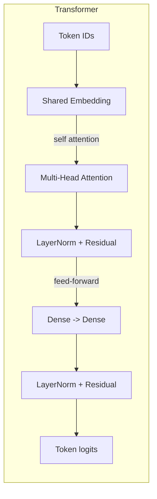
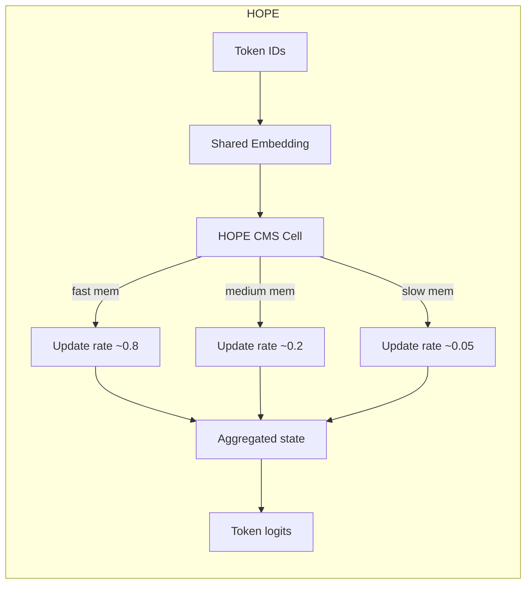

# Tiny Nested Learning Playground

This walkthrough mirrors Google's *Nested Learning* blog post and introduces a minimal hands-on comparison between:

- a **tiny Transformer encoder** (baseline attention-only learner), and
- a **tiny HOPE-inspired recurrent block** with a continuum memory system (CMS) that updates hidden memories at slow, medium, and fast timescales.

Both models solve two **very simple travel stories** so you can see forgetting vs. retention using plain English, not math:
- **Task 0 – Catch a train:** sentences like “i walk to the station with my ticket”.
- **Task 1 – Catch a flight:** sentences like “i take a cab to the busy airport”.

## Setup

```sh
cd /Users/sumitghosh/source/github/ai-examples/tiny-nested-learning
poetry env use /usr/local/bin/python3.11
poetry install
poetry shell
python main.py
```

## What the script does

1. **Builds two tiny text tasks** from short travel sentences:
   - Task 0: going to the station to catch a train.  
   - Task 1: going to the airport to catch a flight.  
   Every sentence is split into words, padded, and used for *next-word* prediction.
2. **Trains the tiny Transformer** (`models/transformer.py`) on Task 0 first, then Task 1, and records accuracy on both tasks after each stage.
3. **Trains the HOPE-style model** (`models/hope.py`) the same way, but with three memories (`fast`, `medium`, `slow`) that update at different speeds.
4. **Prints retention tables** so you can see how much accuracy each model keeps on Task 0 after Task 1 training completes.

## In very simple words

- **Think of teaching a child in two short lessons**:
  - Lesson 1: how to catch a **train** (pack bag, go to station, wait, sit, watch trees).
  - Lesson 2: how to catch a **flight** (pack bag, go to airport, wait at gate, sit, watch clouds).
- The computer reads these sentences word by word and learns **“what word usually comes next”**.
- We then ask:
  - After learning about flights, **how well does it still remember trains?**
  - We compare a **Transformer brain** (one big flexible memory) with a **HOPE brain** (three memories: fast, medium, slow).
- If the HOPE brain forgets less about trains after learning flights, it shows why **nested, multi-timescale memory** can be useful for continual learning.

## Mini architecture diagrams




## Customize & explore

- Change `update_rates` in `build_tiny_hope` to simulate different CMS horizons.
- Add more travel stories (e.g., bus trip, road trip) or increase vocabulary size to stress long-term retention.
- Swap the optimizer or learning rate per model to see how sensitive each architecture is.

This tiny playground is not an exact reproduction of Google's experimental stack, but it captures the **nested, multi-timescale update** idea in a few dozen lines of TensorFlow so you can reason about HOPE vs. Transformer behavior locally.

## A bit more about the HOPE brain

- **Regular brain (Transformer / simple RNN)**:
  - Has **one main memory** that gets updated every time we train on new data.
  - When we fine-tune on the flight story, the same memory is changed, so train-story knowledge can be overwritten.

- **HOPE brain (in this project)**:
  - Has **three memories**:
    - **Fast memory**: updates a lot each step → quickly learns new details, quickly forgets.
    - **Medium memory**: updates a bit each step → balances old and new.
    - **Slow memory**: updates very slowly → keeps long-term knowledge safe.
  - At each word:
    1. The model looks at the **current word + all three memories**.
    2. A small **controller network** suggests a new “shared idea” for what memories could store now.
    3. Another small network (**rate adapter**) decides how strongly each memory (fast/medium/slow) should move toward that idea.
    4. Each memory is updated softly:  
       `new = (1 - rate) * old + rate * idea`.
    5. The model **averages the three memories** and uses that to guess the next word.

- **Why this helps**:
  - When learning the flight story, fast memory can change a lot without destroying slow memory.
  - Slow memory still carries pieces of the train story, so even after learning flights, the HOPE model can still remember trains better than a single-memory model.

## RNN vs Transformer vs HOPE (quick comparison)

| Model        | Main idea                          | Memory style                      | Strengths                                         | Weaknesses for continual learning                      |
| ------------ | -----------------------------------|-----------------------------------|--------------------------------------------------|--------------------------------------------------------|
| **RNN**      | Processes tokens one by one        | **Single hidden state** updated every step | Simple, lightweight, naturally sequential       | One state is overwritten easily when learning new data |
| **Transformer** | Looks at all tokens with attention | **Implicit memory in parameters + attention context** | Great parallelism, strong modeling power        | Fine-tuning on new tasks can rewrite shared weights    |
| **HOPE (this project)** | RNN with multi-timescale states | **Three states** (fast / medium / slow) updated at different speeds | Can let fast memory adapt while slow memory protects old knowledge | More complex cell, needs careful tuning of update rates |

## Why “Nested Learning”?

- In classic training, we usually think of **one main learning loop**: update the model’s parameters to fit the current data.
- In **Nested Learning**, we think in terms of **several learning processes nested inside each other**, each operating at a different time scale:
  - **Fast level**: adjusts quickly to the most recent data (like the fast memory in HOPE).
  - **Medium level**: changes more slowly, capturing patterns that matter across many steps.
  - **Slow level**: changes very slowly, keeping long-term knowledge stable over many tasks.
- In this tiny project:
  - The **HOPE cell** is a small example of this idea: its fast/medium/slow memories are like **nested learners** that update at different speeds but work together.
  - When you train on the flight story after the train story, you are effectively updating these nested memories differently, instead of updating a single flat state.
- This nested structure is what gives the architecture a better chance to **learn new things without erasing old things**, which is the core motivation behind Nested Learning.


