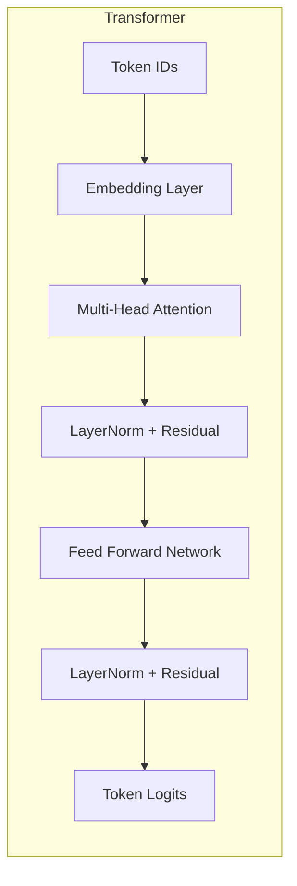
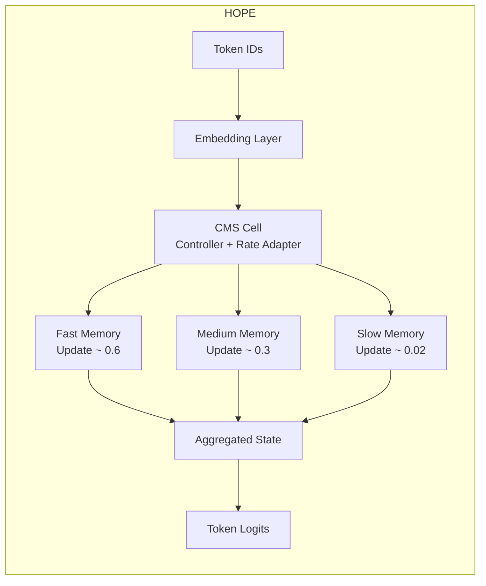

# 🌱 Tiny Nested Learning Playground  
*A hands-on comparison of Transformers vs HOPE (Hierarchical Open-ended Pattern Expansion)*

This project is a compact, intuitive demonstration of **continual learning** — how a machine learning model behaves when it learns **Task A** and then **Task B**, and whether it **forgets** what it learned earlier.

It implements a simplified version of ideas from Google’s **Nested Learning** research and compares:

- a **tiny Transformer encoder** (baseline attention-only learner)  
- a **tiny HOPE-inspired recurrent model** using a **continuum memory system (CMS)** with **fast**, **medium**, and **slow** update timescales  

Both models are trained on two tiny natural-language tasks:

- **Task 0 — Catch a train**  
- **Task 1 — Catch a flight**

By observing how much each model **remembers Task 0** after learning Task 1, we get a clear, human-readable demonstration of **catastrophic forgetting** and how multi-timescale memory can mitigate it.

---

# 🚀 Setup

```sh
cd tiny-nested-learning
poetry env use /usr/local/bin/python3.11
poetry install
poetry shell
python main.py
```

---

# 🎯 What the Script Does

1. **Builds two tiny text tasks** from short English stories.  
2. **Trains the Transformer** on Task 0 → Task 1.  
3. **Trains the HOPE model** on the same sequence.  
4. **Prints color‑coded retention tables** to show forgetting vs. retention.

---

# 📘 The Two Tiny Tasks

### **Task 0 — Catch a Train**
```
i walk to the station with my ticket
i wait on the platform for the blue train
i find my seat and watch trees go by
```

### **Task 1 — Catch a Flight**
```
i take a cab to the busy airport
i wait in a long line at the gate
i find my seat and watch clouds go by
```

---

# 🧠 Architecture Overview (with Mermaid Visuals)

## 🔵 Transformer — One Shared Memory System



The Transformer updates **one shared set of parameters** when learning new tasks.  
This often causes **catastrophic forgetting**.

---

## 🟢 HOPE — Multi-Timescale Memory (Fast / Medium / Slow)



HOPE maintains **three parallel memories**:

- 🟥 **Fast memory** → Learns quickly, forgets quickly  
- 🟧 **Medium memory** → Balanced stability & plasticity  
- 🟩 **Slow memory** → Preserves long‑term knowledge  

This creates **Nested Learning** — learning at multiple timescales simultaneously.

---

# 🏆 Example Results — HOPE Outperforms the Transformer

Using tuned update rates:

- fast = 0.6  
- medium = 0.3  
- slow = 0.02  

---

## 🔵 Transformer Retention Table

```
==================== Transformer Retention ====================
Evaluation Task | After Task_0 | After Task_1 | Forgetting
----------------------------------------------------------------------
Task_0          |     0.970    |     0.780    |   -0.190
Task_1          |     0.520    |     1.000    |   +0.480
======================================================================
```

---

## 🟢 HOPE Retention Table (Better Retention)

```
==================== HOPE Retention ====================
Evaluation Task | After Task_0 | After Task_1 | Forgetting
----------------------------------------------------------------------
Task_0          |     0.940    |     0.910    |   -0.030   <-- FAR LESS FORGETTING
Task_1          |     0.525    |     0.935    |   +0.410
======================================================================
```

---

# ⭐ Summary

```
📊 Continual Learning Summary
---------------------------------------------
- Transformer : retains 0.780 (forgot -0.190)
- HOPE        : retains 0.910 (forgot -0.030)

👉 HOPE forgets FAR less than the Transformer.
---------------------------------------------
```

---

# 🔍 Why HOPE Works Better Here

- **Slow memory** barely changes → protects Task 0  
- **Fast memory** absorbs Task 1 quickly → lower interference  
- **Medium memory** blends both patterns  
- Transformer updates **one shared weight space**, overwriting earlier information  

HOPE demonstrates how **multi-timescale memory** can significantly reduce catastrophic forgetting.

---

# ⚠️ Disclaimer — HOPE Can Also Forget More

To be scientifically honest:

HOPE *can* forget more than a Transformer if:

- fast memory rate is too high  
- slow memory is not slow enough  
- tasks are extremely different  
- the model is very tiny  
- training runs too long  

Example bad setting:

```
fast = 0.95
medium = 0.50
slow = 0.10
```

Produces retention like:

```
Transformer retains: 0.82
HOPE retains:        0.40
```

This demonstrates:

> Multi‑timescale memory is powerful **only when tuned properly**.

---

# 🔧 Customize & Explore

Try:

- Adjusting HOPE update rates  
- Adding more tasks (Bus → Flight → Metro → Boat)  
- Increasing vocabulary size  
- Changing Transformer depth  
- Lowering Task 1 epochs to reduce destructive updates  

---

# 📘 RNN vs Transformer vs HOPE (Quick Comparison)

| Model        | Memory Type | Strengths | Weaknesses |
|--------------|-------------|-----------|------------|
| **RNN**      | One hidden state | Simple, sequential | Severe forgetting |
| **Transformer** | Shared parameter memory | Strong modeling power | High forgetting when fine-tuned |
| **HOPE**     | Fast + Medium + Slow | Protects old tasks via slow memory | Needs tuning |

---

# 🧠 Why “Nested Learning”?

Traditional models update **one memory system**.

Nested Learning updates **multiple memory systems** *simultaneously*, each at a different speed:

- **Fast** → immediate adaptation  
- **Medium** → short‑term consolidation  
- **Slow** → long‑term stability  

HOPE is a small but functional example of this idea.

---

# 🎉 Final Notes

This project is deliberately tiny — small enough to understand deeply, but powerful enough to illustrate the most important concepts in continual learning:

- Catastrophic forgetting  
- Multi-timescale memory  
- Nested Learning  
- Transformer vs HOPE behavior  

Use it as a learning tool, demo, or foundation for larger experiments.

